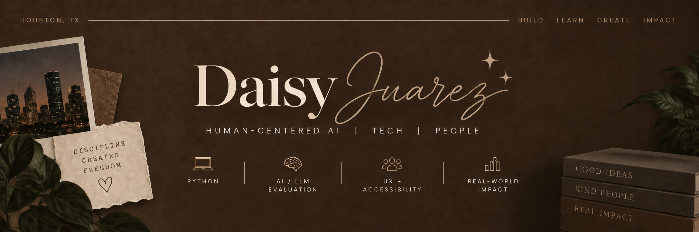

### a little about me ✨

currently studying Human-Centered AI at Texas Tech after finishing my A.S. in Computer Science at Houston Community College.

i'm especially interested in how AI actually works for people. i like testing where it gets things right, where it doesn't, and figuring out how we can make the experience better for the people actually using it.

### what i've been building ✨

**Rental Calculator**  
a Python project for calculating and comparing rental costs.

**Nondirective Therapy Chatbot**  
exploring conversational AI, user experience, and ethical design.

**AI Bias Testing**  
testing how LLM responses change across different audiences and prompts.

**Digital Accessibility Study**  
looking at accessibility through real-world digital experiences.

---

currently cleaning up old projects + building new ones ✨
